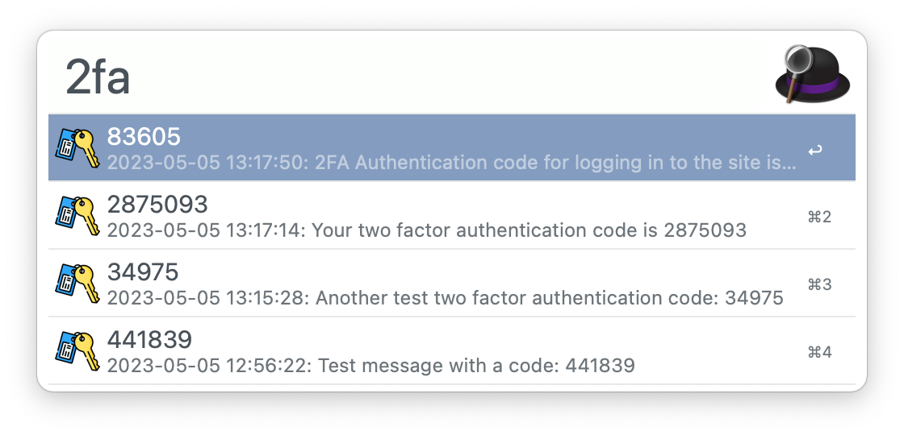

# 2FA Code from Messages

An [Alfred](https://www.alfredapp.com/) workflow that finds two-factor authentication codes in your recent iMessages and pastes them for you — type `2fa`, pick the code, done.

[](https://github.com/thanegill/alfred-imessage-2fa/actions/workflows/test.yml)



*Recent codes in Alfred — type `2fa`, then pick one to paste it.*

This is a `bash` reimplementation of a partial copy of [squatto/alfred-imessage-2fa](https://github.com/squatto/alfred-imessage-2fa) (which is written in PHP). All the work happens in [`get_codes.sh`](get_codes.sh); the rest of the workflow is wiring in [`info.plist`](info.plist).

## Requirements

- **macOS** with the **Messages** app receiving your SMS — set up [Text Message Forwarding](https://support.apple.com/guide/iphone/get-sms-text-messages-on-mac-iph3c6f0b3f/ios) on your iPhone so codes arrive on your Mac.
- **Alfred** with the [Powerpack](https://www.alfredapp.com/powerpack/) (workflows require it).
- **Full Disk Access for Alfred**, so it can read your Messages database at `~/Library/Messages/chat.db`. Grant it under System Settings → Privacy & Security → Full Disk Access.
- `sqlite3`, which ships with macOS.

## Install

Download the latest `.alfredworkflow` file from the [Releases](https://github.com/thanegill/alfred-imessage-2fa/releases) page and double-click it to import into Alfred.

## Usage

Trigger Alfred and type the keyword `2fa`. Codes found in messages from the last 15 minutes are listed, newest first; press Enter on one to paste it into the app you were just using.

- **The list refreshes itself while open**, so a code that lands a second after you open the list still shows up — no need to retype `2fa`.
- **Change the look-back window** with the `LOOK_BACK_MINUTES` workflow environment variable (Alfred → the workflow → *Configure Workflow and Variables*). Default is 15.

## How it works

[`get_codes.sh`](get_codes.sh) queries `chat.db` for recent SMS messages containing digits, then for each message:

- **Strips phone numbers first** so a support or callback number isn't offered as a code. Only 10-digit (and country-code-prefixed) numbers in common formats are removed — `1-800-555-1234`, `(800) 555-1234`, `800 555 1234`, `+1.800.555.0142`. Shorter 7-digit numbers are left alone because they're indistinguishable from real codes.
- **Extracts each remaining run of 3+ digits as a candidate code**, keeping hyphen-joined codes like Stripe's `719-839` intact.

It prints the candidates as an [Alfred Script Filter](https://www.alfredapp.com/help/workflows/inputs/script-filter/) JSON feed.

## Development

```sh
./test.sh                  # run the test suite (also writes JUnit test_results.xml)
./get_codes.sh --test      # run the extractor against the fixtures, not your real Messages db
./get_codes.sh --test --debug   # same, with shell xtrace and a wider look-back
./get_codes.sh --help      # usage and flags
```

[`test.sh`](test.sh) feeds the fixture messages in [`test_messages.txt`](test_messages.txt) through the extractor and compares the codes it finds against the expected list in [`test_messages_results.txt`](test_messages_results.txt). [CI](.github/workflows/test.yml) runs it on every push; add a message-and-expected-code pair to those two files when you fix a parsing case.

## Release process

1. Commit any changes to `master`.
2. Tag the commit `vX.Y.Z` and push the tag. The tag triggers the [release workflow](.github/workflows/release.yml), which stamps the version from the tag (`v0.6.0` → `0.6.0`), packages the `.alfredworkflow`, and publishes a GitHub release with auto-generated notes.

## License

[MIT](LICENSE).
